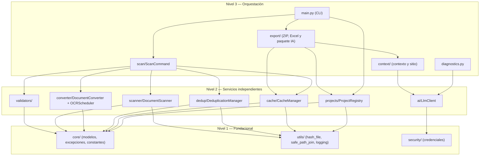

# Arquitectura

`doc_organize` se organiza en tres capas, de fundacional a orquestación (ver
`.github/instructions/architecture.instructions.md` en el repositorio para la
convención completa):

- **Nivel 1 — Fundacional** (`core/`, `utils/`, `security/`): sin dependencias del resto del
  paquete. Modelos, excepciones, constantes, hashing, validación de rutas y redacción de credenciales.
- **Nivel 2 — Servicios independientes** (`validators/`, `scanner/`, `converter/`,
  `dedup/`, `cache/`, `projects/`, `ai/`): cada uno resuelve una responsabilidad
  del dominio sin depender de los otros módulos de su mismo nivel, salvo las excepciones de la regla #6. `ai/` es el cliente único
  de IA desde 2.0.0 (ver [Cliente único de IA](llm_client.md)).
- **Nivel 3 — Orquestación** (`scan/`, `context/`, `export/`, `diagnostics.py`, `main.py`): coordinan los servicios
  de Nivel 2 sin cambiar sus contratos. `scan/`, `context/` (contexto, taxonomía y sitio, ver
  [Organización documental](context.md)) y `export/` (ZIP y Excel de un proyecto, ver
  [Exportación](export.md)) los comparten el CLI y doc_organize_web.

Desde 1.0.0 la librería no incluye interfaz web ni autenticación (L-11): las da
[doc_organize_web](https://github.com/fmanza/doc_organize_web). Un test de arquitectura
(`tests/unit/test_library_architecture.py`) falla si `src/` vuelve a importar FastAPI,
Starlette, uvicorn, Jinja2 o `python-multipart`, o si reaparecen `doc_organize.web` o
`doc_organize.auth`. Lo que había antes está en el [histórico](../historico/index.md).

El mismo test comprueba la jerarquía: las dependencias van solo hacia abajo, contando también los imports diferidos y
los de `TYPE_CHECKING`. Las únicas excepciones aceptadas, cada una con su motivo, están en la regla #6:
`projects/` → `validators/`, `converter/` y `dedup/` → `projects/layout.py`, `dedup/` → `ai/` y `dedup/` → `context/`
(duplicados por contenido, 2.2.0), `ai/` → `context/` (solo tipos) y `export/` → `context/`.

```mermaid
graph TB
    subgraph L3["Nivel 3 — Orquestación"]
        CLI["main.py (CLI)"]
        ScanCmd["scan/ScanCommand"]
        Ctx["context/ (contexto y sitio)"]
        Export["export/ (ZIP, Excel y paquete IA)"]
        Diag["diagnostics.py"]
    end

    subgraph L2["Nivel 2 — Servicios independientes"]
        Validators["validators/"]
        Scanner["scanner/DocumentScanner"]
        Converter["converter/DocumentConverter + OCRScheduler"]
        Dedup["dedup/DeduplicationManager"]
        Cache["cache/CacheManager"]
        Projects["projects/ProjectRegistry"]
        AI["ai/LlmClient"]
    end

    subgraph L1["Nivel 1 — Fundacional"]
        Core["core/ (modelos, excepciones, constantes)"]
        Utils["utils/ (hash_file, safe_path_join, logging)"]
        Security["security/ (credenciales)"]
    end

    CLI --> ScanCmd
    CLI --> Export
    Export --> Cache
    Export --> Projects
    CLI --> Projects
    Ctx --> AI
    Export --> Ctx
    Diag --> AI
    AI --> Security

    ScanCmd --> Validators
    ScanCmd --> Scanner
    ScanCmd --> Converter
    ScanCmd --> Dedup
    ScanCmd --> Cache

    Validators --> Core
    Scanner --> Utils
    Scanner --> Core
    Converter --> Core
    Dedup --> Utils
    Dedup --> Core
    Cache --> Utils
    Cache --> Core
    Projects --> Utils
    Projects --> Core
```

## Referencia

Generada desde los docstrings del código (Google-style).

::: doc_organize.core.models
::: doc_organize.core.exceptions
::: doc_organize.scanner.document_scanner
::: doc_organize.converter.converter
::: doc_organize.converter.ocr_scheduler
::: doc_organize.dedup.deduplication
::: doc_organize.cache.cache_manager
::: doc_organize.projects.project_registry
::: doc_organize.scan.scan_command
